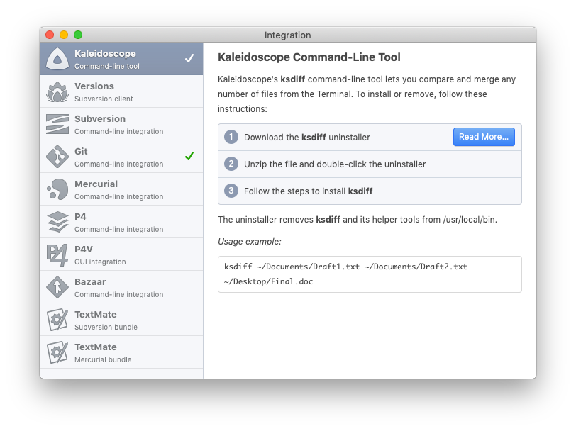
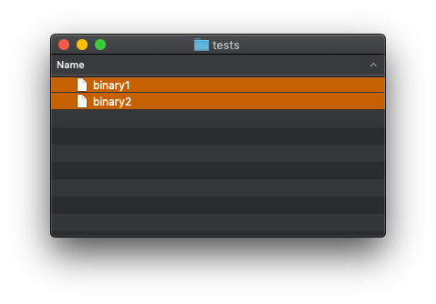
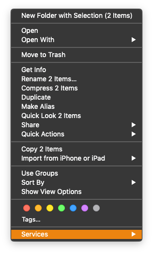
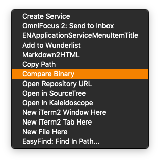
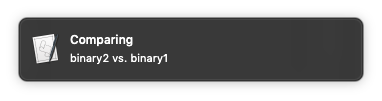
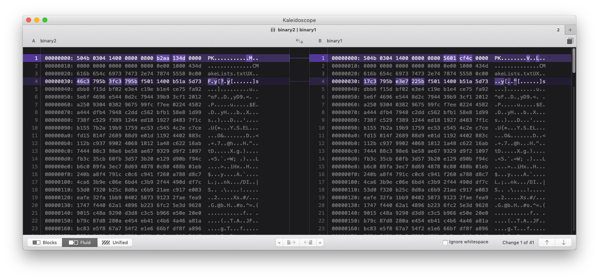

# Compare Binary Workflow

Compare arbitrary, binary files with Kaleidoscope.

## Motivation

This Automator workflow was created for allowing binary files to get compared in a nice, visual way.
Kaleidoscope is a superb diff tool, it does however not provide any means of comparing arbitrary, binary files - which is a shame.

## Dependencies

[Kaleidoscope](https://www.kaleidoscopeapp.com) - Visual comparison app.

## Installing

First, make sure Kaleidoscope's commandline utility `ksdiff` is installed.

Next, simply click on this workflow within your Finder to get it installed.

## Usage

Navigate your Finder towards the binary files you want to compare. Select both files!

Control click / Right click on the selection to get to the **Services** menu.

Chose the **Compare Binary** item.

Let it do its thing and get notified about progress.

The result will be nice hex diff shown within the now even more magnificent Kaleidoscope.

## Credits

Clobbed together with love for reversing and passion for tinkering by [Till Toenshoff](https://twitter.com/ttoenshoff).
